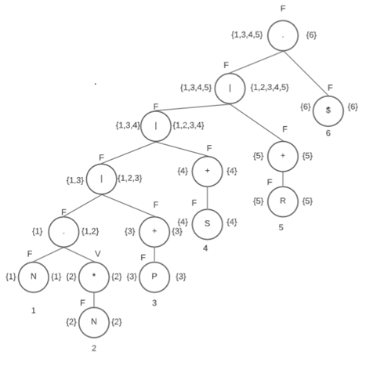
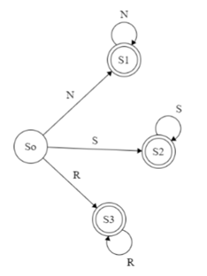

#### Universidad de San Carlos de Guatemala
#### Facultad de Ingeniería
#### Escuela de Ciencias y Sistemas

---
---

# Manual Técnico
# BIZDATA - PROGRAM

---

Edison Mauricio García Rodríguez

202200031

Laboratorio de Lenguajes Formales y Programación A-

Aux: Enrique Pinula

---
---

## Introducción
A continuación se detallan las características técnicas del software de BIZDATA - PROGRAM, tanto como el lenguaje de programación y herramientas utlizadas para el desarrollo de este software.

## Requerimientos del Sistema
### Sotware

* Python: Lenguaje de programación utilizado para la elaboración del software BIZDATA - PROGRAM, en su versión Python 3.11.1. En dado caso, no se tiene instalado, se puede obtener en [Descargar Python](https://www.python.org/downloads/ "Python")

* Graphviz: Software implementado para la representación de datos de manera gráfica.  [Descargar Graphviz](https://graphviz.org/download/ "Graphviz")

* Html: Es un lenguaje de marcado que nos permite indicar la estructura de nuestro documento mediante etiquetas. Se utiliza para estructurar y desplegar una página web y sus contenidos. Fue útil para los reportes generados por nuestro software.

* Css: (Hojas de Estilo en Cascada) es un lenguaje para la composición y estructuración de páginas web tanto html como xml, fue útil para darle un diseño agradable de los reportes generados por nuestro software BIZDATA - PROGRAM.

* Bootstrap: Es una biblioteca multiplataforma o conjunto de herramientas de código abierto para diseño de sitios y aplicaciones web.  Nos fue útil para darle un diseño moderno e innovador a nuestros reportes generados en html que se despliegan en el navegador predeterminado de nuestro computador.

### Librerías

* Tkinter: Se implementó la librería de Tkinter para el entorno visual del software BIZDATA - PROGRAM, esta es una librería propia de Python por lo que no se debe instalar nada respecto a Tkinter, únicamente importar la librería al momento de hacer uso de esta.

* Graphviz: Es un software de código abierto para representar gráficamente estructuras de datos, diagramas de flujo, redes, diagramas UML, entre otros.  Para efectos de este software se implementó Graphviz, para generar la gráfica de las operaciones y resultados contenidas en el archivo .json, previamente cargado de manera correcta.

## Funcionalidad

El software de BIZDATA - PROGRAM es capaz de realizar un análisis al archivo .bizdata, posterior a ello se genera un reporte de registros, tokens válidos, errores y se genera una gráfica, todo esto se desarrolla a través de un entorno visual de manera gráfica, usando la librería **Tkinter** para implementar interfaces gráficas.


## Lógica del Software
Se ingresa un archivo con extensión .bizdata el cual tiene un conjunto de Claves, Registros e Instrucciones las cuales el programa va leyendo y a su vez verificando si existe algún tipo de error, dando a su vez un reporte si lo hay y de lo contrario se sigue ejecutando el programa por medio de la interfaz gráfica 

## Expresiones Regulares

* Tabla de Expresiones:

    | Números                 | N   | [0-9]                    | 
    |:-----------------------:|:---:|:------------------------:|
    | Palabras Reservadas     | P   | [a-zA-Z]                 |
    | Signos                  | S   | [= () {} , ; [] # ""]    |
    | Resto de Signos         | R   | Signos random            |
    | Expresión Regular       |      [N.N* / P+ / S+ / R*]$    |


## Método del Árbol y AFD

* Tabla de Follow:

    | Elemento   | Follow  |
    |:----------:|:-------:|
    | 1 - N      | 2,6     |
    | 2 - N      | 2,6     |
    | 3 - P      | 3,6     |
    | 4 - S      | 4,6     |
    | 5 - R      | 5,6     |
    | 6 - $      |         |


* Diagrama del Árbol:

    

* AFD:

    * Tabla de Transiciones:

            | Estado  | N  | S  | R  |
            |:-------:|:--:|:--:|:--:|
            | So      | S1 | S2 | S3 |
            | S1      | S1 | So | So |
            | S2      | So | S2 | So |
            | S3      | So | So | S3 |


    * Diagrama:

        


## Grámatica Independiente del Contexto - Analizador Sintáctico

```
<INICIO> ::= <Clave> 
          | <Registros> 
          | <Instrucciones> 
 
<Clave> ::= <tk_Clave> <tk_igual> <tk_corcheteI>  <BloqueClave> 
<tk_corcheteD>  
 
<BloqueClave> ::= <CuerpoClave> <BloqueClave> 
                | <CuerpoClave> 
 
<CuerpoClave> ::= <tk_llaveI> <tk_cadena><MasClaves> <tk_llaveD> 
 
<MasClaves> ::= <tk_coma> <tk_cadena> <MasClaves> 
          | <tk_cadena> 
 
<Registros> ::= <tk_Registro> <tk_igual> <tk_corcheteI> <BloqueRegistro> 
<tk_corcheteD> 
 
<BloqueRegistro> ::= <CuerpoRegistro> <BloqueRegistro> 
                    | <CuerpoRegistro> 
 
<CuerpoRegistro> ::= <tk_llaveI> <tk_cadena> <MasRegistros> <tk_llaveD> 
                    | <tk_llaveI> <tk_numero> <MasRegistros> <tk_llaveD> 
 
<MasRegistros> ::= <tk_coma> <tk_cadena> <MasRegistros> 
                 | <tk_coma> <tk_numero> <MasRegistros> 
                 | <tk_cadena> 
                 | <tk_numero> 
 
<Instrucciones> :== <tk_imprimir> <tk_parentesisI> <tk_cadena> 
<tk_parentesisD> <tk_puntoycoma> 
                  | <tk_imprimirln> <tk_parentesisI> <tk_cadena> <tk_parentesisD> 
<tk_puntoycoma> 
                  | <tk_conteo> <tk_parentesisI> <tk_parentesisD> <tk_puntoycoma> 
                  | <tk_promedio> <tk_parentesisI> <tk_cadena> <tk_parentesisD> 
<tk_puntoycoma> 
                  | <tk_contarsi> <tk_parentesisI> <tk_cadena> <tk_coma> <tk_numero> 
<tk_parentesisD> <tk_puntoycoma> 
                  | <tk_datos> <tk_parentesisI> <tk_parentesisD> <tk_puntoycoma> 
                  | <tk_sumar> <tk_parentesisI> <tk_cadena> <tk_parentesisD> 
<tk_puntoycoma> 
                  | <tk_max> <tk_parentesisI> <tk_cadena> <tk_parentesisD> 
<tk_puntoycoma> 
                  | <tk_min> <tk_parentesisI> <tk_cadena> <tk_parentesisD> 
<tk_puntoycoma> 
                  | <tk_exportarReporte> <tk_parentesisI> <tk_cadena> 
<tk_parentesisD> <tk_puntoycoma> 
```
