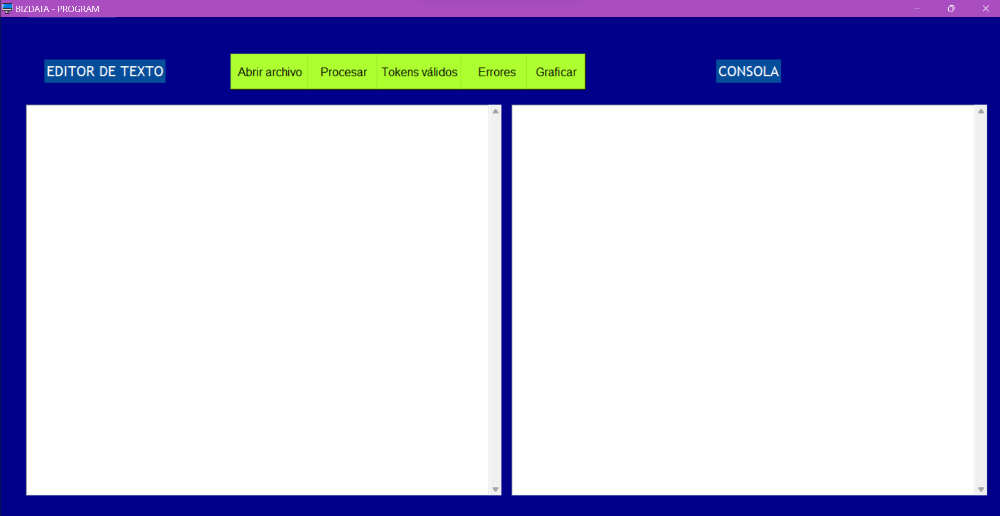
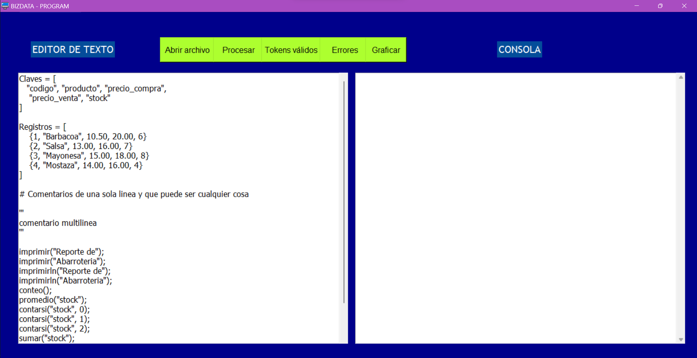
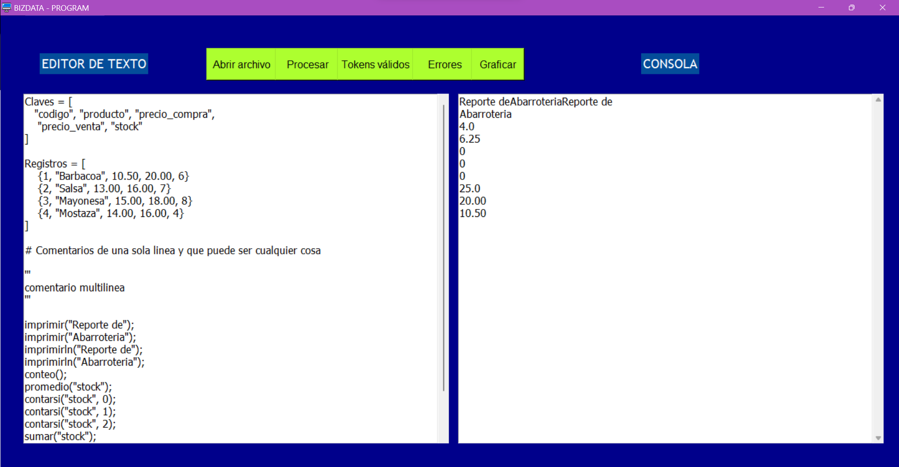
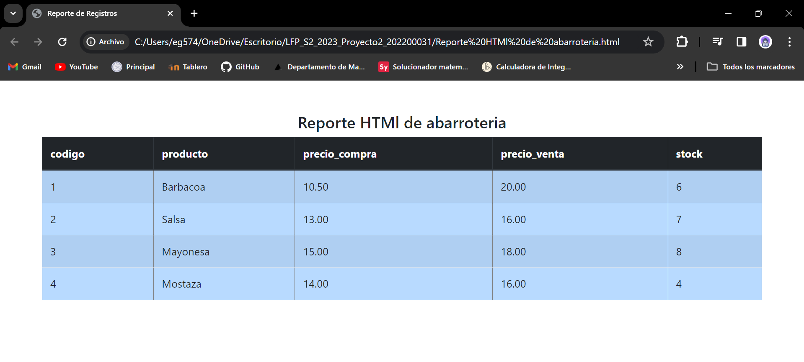
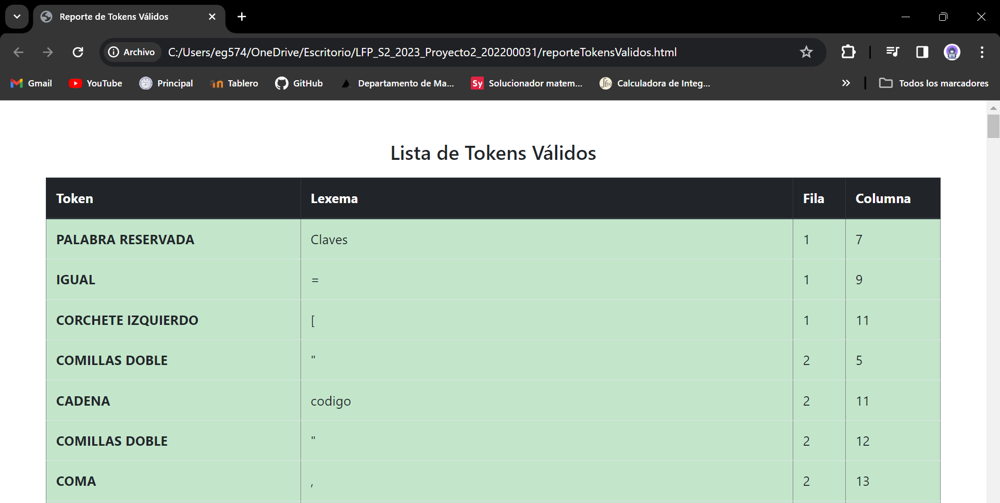
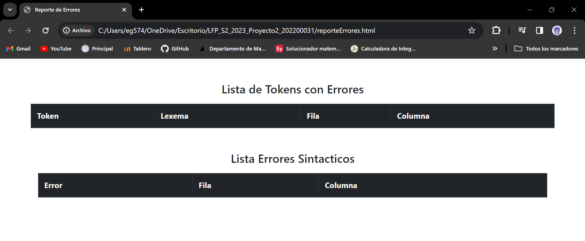
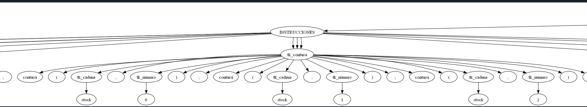

#### Universidad de San Carlos de Guatemala
#### Facultad de Ingeniería
#### Escuela de Ciencias y Sistemas

---
---

# Manual de Usuario
# BIZDATA - PROGRAM

---

Edison Mauricio García Rodríguez

202200031

Laboratorio de Lenguajes Formales y Programación A-

Aux: Enrique Pinula

---
---

## Introducción
El software de BIZDATA fue desarrollado mediante el lenguaje de programación Python, este recibe como archivo de entrada un archivo con extensión .bizdata, posterior a ello se realiza el análisis del archivo y se generan los resultados del registro en un archivo HTML que se visualiza en pantalla por medio de nuestro navegador predeterminado, esto sucede de igual manera con los tokens válidos y los errores que dicho archivo contenga y por último se tiene la opción de Graficar, en donde se muestra el árbol de derivación que contiene el archivo .bizdata, de igual manera en el cuadro de texto se puede manipular dicho archivo, previamente cargado, una vez cargado el archivo se habilitan las opciones antes mencionadas, esto para mejorar la interacción del software con el usuario.

## Características
### A. Ventana Principal
A continuación se muestra una imagen donde se puede visualizar el entorno de la interfaz del software BIZDATA - PROGRAM:

### B. Abrir Archivo
Esta opción nos permite cargar el archivo con extensión .bizdata para poder trabajar con ello, de esta manera se estaría trabajando las demás funciones y de igual manera podemos visualizar su contenido en el apartado de editor de texto.

### C. Procesar
Al presionar este botón se estarían ejecutando las instrucciones contenidas en el archivo .bizdata que podemos visualizar en el apartado de consola y nos estaría reflejando una tabla con los registros contenidos en dicho archivo, este último se nos abrirá automáticamente en nuestro navegador predeterminado.

### D. Tokens Válidos
De igual manera al presionar el botón de **Tokens Válidos** se nos estaría abriendo una ventana en nuestro navegador predeterminado donde podremos visualizar una lista de los tokens válidos contenidos en nuestro archivo .bizdata previamente analizado.

### E. Errores
También encontramos un botón de **Errores** el cual nos permitirá visualizar los errores léxicos y sintácticos de nuestro archivo .bizdata analizado y lo mostrará en una ventana en nuestro navegador predeterminado, una lista con dichos errores.

### F. Graficar
En nuestra ventana principal se nos brinda un botón **Graficar**, al presionarlo obtendremos la gráfica de nuestro archivo .bizdata previamente analizado. 

A continuación se muestra una imagen que hace referencia a nuestra gráfica:

